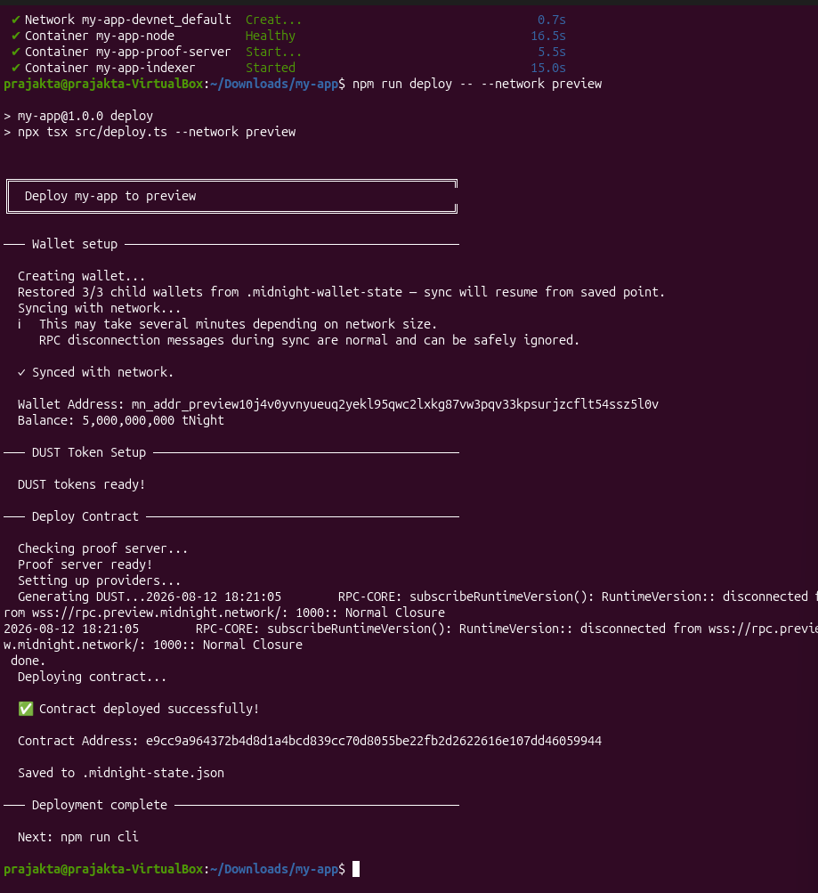

# Midnight Privacy-Preserving DApp

> A decentralized application built on the **Midnight Network** using the **Compact** smart contract language, leveraging Zero-Knowledge (ZK) cryptography for privacy-preserving verifiable data storage and state management.

---

## 📋 Table of Contents
- [Project Title](#midnight-privacy-preserving-dapp)
- [Project Description](#-project-description)
- [Project Vision](#-project-vision)
- [Key Features](#-key-features)
- [Mainnet / Testnet Contract Details](#-mainnet--testnet-contract-details)
- [Future Scope](#-future-scope)
- [Getting Started & Local Setup](#-getting-started--local-setup)
- [Project Structure](#-project-structure)

---

## 📖 Project Description

This project is a privacy-first decentralized application developed on **Midnight Network**, a next-generation privacy blockchain engineered by Input Output Global (IOG) specifically designed for data protection, confidentiality, and regulatory compliance.

The core contract is written in **Compact**—Midnight's domain-specific programming language for zero-knowledge smart contracts. The application demonstrates how sensitive user data can be managed privately client-side while selectively disclosing specific information onto the public blockchain ledger using ZK proofs generated by a dedicated local or remote proof server.

---

## 🎯 Project Vision

Our vision is to empower users and developers with privacy-by-design Web3 infrastructure. By leveraging Midnight's zero-knowledge cryptography, we aim to bridge the gap between user data protection and public blockchain verifiability.

- **Privacy by Default**: Sensitive computational state and witness data remain private on the user's local machine.
- **Selective Disclosure**: Users retain total ownership and control over what information is disclosed to the public ledger.
- **Verifiable Integrity**: Smart contract state transitions are validated cryptographically using ZK-SNARK proofs without exposing confidential underlying data.

---

## ✨ Key Features

- 🔐 **Zero-Knowledge Smart Contracts**: Engineered in Compact (`hello-world.compact`), enabling privacy-preserving state transitions and ZK proof generation.
- 👁️ **Selective Disclosure Circuit**: Uses Compact's `disclose()` mechanism to control public visibility of ledger state elements (`storeMessage` circuit).
- 🌐 **Multi-Network Architecture**: Seamless deployment and execution support for:
  - **Local Devnet**: Docker-orchestrated Midnight node, GraphQL indexer, and proof-server.
  - **Midnight Preview Testnet**: Public preview environment with tNIGHT faucet polling.
  - **Midnight Preprod Testnet**: Public pre-production testing environment.
- 🧰 **Automated Wallet & State Persistence**: Local wallet seed derivation, UTXO management for DUST generation, and serialized state synchronization (`.midnight-state.json`).
- 💻 **Interactive CLI & E2E Verification**: Command-line interface to execute smart contract circuits interactively alongside automated end-to-end (E2E) verification scripts.

---

## 📜 Mainnet / Testnet Contract Details

### 🧪 Midnight Preview Testnet Deployment

| Parameter | Details |
|---|---|
| **Network** | Midnight Preview Testnet |
| **Contract ID (Address)** | `e9cc9a964372b4d8d1a4bcd839cc70d8055be22fb2d2622616e107dd46059944` |
| **Deployer Address** | `mn_addr_preview10j4v0yvnyueuq2yekl9sqwc2lxkg87vw3pqv33kpsurjzcflt54ssz5l0v` |
| **Compiler Version** | Compact v0.23+ |
| **Wallet Balance** | `5,000,000,000 tNight` |
| **Contract Status** | 🟢 Active & Live on Testnet |

### 💻 Local Devnet Deployment

| Parameter | Details |
|---|---|
| **Network** | Local Devnet (`undeployed`) |
| **Contract ID (Address)** | `cf5afd6fcc6368ff758fbb7908e88cced7e84ac73f680681faaf7799f002cef2` |
| **Deployer Address** | `mn_addr_undeployed1h3ssm5ru2t6eqy4g3she78zlxn96e36ms6pq996aduvmateh9p9sk96u7s` |
| **Node RPC / Indexer** | `http://localhost:9944` / `http://localhost:8088` |

---

### 📸 Deployed Contract Screenshot

Below is the verified screenshot showing the deployed contract details and output from the Midnight Testnet deployment (`npm run deploy -- --network preview`):



---

## 🔮 Future Scope

- 🛡️ **Advanced ZK Privacy Schemes**: Implement private state circuits (shielded key-value storage, zero-knowledge access control tokens, and private balance transactions).
- 🖥️ **Web Frontend & Wallet Integration**: Develop a modern React / Next.js web application integrated with the **Midnight Lace Wallet** browser extension for seamless web transactions.
- 🤝 **Multi-Party Confidential Computation**: Enable multi-user zero-knowledge interactions where secret inputs from multiple independent participants can be computed confidentially.
- 🚀 **Mainnet Deployment & Security Audits**: Perform formal verifications and smart contract security audits prior to deploying onto the upcoming Midnight Mainnet.
- 🌉 **Cross-Chain Interoperability**: Explore cross-chain privacy bridges connecting Midnight Network with Cardano and Ethereum ecosystems.

---

## 🛠️ Getting Started & Local Setup

### Prerequisites
- Node.js >= 22.0.0
- Docker & Docker Compose v2
- Compact Compiler (v0.23+)

### Installation & One-Shot Setup

```bash
# Install dependencies
npm install

# Start local devnet (Docker), compile Compact contracts, and deploy
npm run setup

# Run end-to-end read-back tests
npm run test:e2e

# Interact via interactive CLI
npm run cli
```

### Network Switching Commands

```bash
npm run network preview     # Switch active network to Preview Testnet
npm run network preprod     # Switch active network to Preprod Testnet
npm run network undeployed  # Switch back to local Devnet
```

---

## 📁 Project Structure

```
my-app/
├── contracts/
│   └── hello-world.compact      # Compact ZK smart contract source
├── docs/
│   └── deployment_screenshot.png # Deployed contract screenshot
├── scripts/
│   └── e2e-check.ts             # E2E test suite
├── src/
│   ├── network.ts               # Network configuration manager
│   ├── wallet.ts                # Wallet construction & state sync
│   ├── setup.ts                 # Devnet startup & compiler orchestrator
│   ├── deploy.ts                # Contract deployment script
│   ├── cli.ts                   # Interactive CLI for circuits
│   └── check-balance.ts         # NIGHT & DUST balance checker
├── docker-compose.yml           # Devnet stack (node, indexer, proof-server)
├── .midnight-state.json         # Deployed contract IDs and wallet states
├── package.json
└── README.md
```
