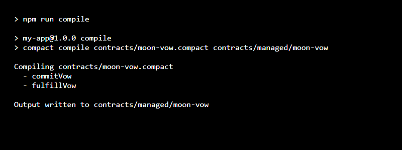

# 🌙 MoonVow — Privacy-First Commitment App on Midnight

> **MoonVow** is a privacy-first personal commitment tracking application built on the **Midnight Network**. Users commit to personal goals at the "new moon"—the fact that they made a vow becomes public on-chain, but the content of the vow stays completely private off-chain. Later, the user can mark their goal fulfilled without ever revealing what the vow was. MoonVow serves as the foundational step toward a broader "phases of commitment" ecosystem (enabling reveal-at-fulfillment, commitment streaks, and social accountability without doxxing your personal goals).

---

## 📋 Table of Contents
- [Product Overview](#-product-overview)
- [Public State vs. Private Witness Architecture](#-public-state-vs-private-witness-architecture)
- [How It Works](#-how-it-works)
- [Mainnet / Testnet Contract Details](#-mainnet--testnet-contract-details)
- [Deployment & Compilation Screenshots](#-deployment--compilation-screenshots)
- [Getting Started & Setup Instructions](#-getting-started--setup-instructions)
- [Project Structure](#-project-structure)

---

## 💡 Product Overview

Traditional goal-tracking platforms either force you to expose your personal ambitions publicly or rely on centralized servers. **MoonVow** leverages Midnight Network's Zero-Knowledge (ZK) smart contracts written in **Compact** to give users cryptographic proof of commitment with complete privacy.

- 🌑 **Private Commitments**: The goal text and salt remain on your local device.
- 🌕 **Verifiable Fulfillment**: Cryptographically prove you completed a previously registered vow without disclosing what it was.
- 🚀 **Phases of Commitment Vision**: Designed to support future expansions including reveal-on-completion, proof-of-streak, and zero-knowledge social accountability circles.

---

## 🔐 Public State vs. Private Witness Architecture

MoonVow explicitly demonstrates the separation between public ledger state and client-side private witnesses in Midnight's Compact smart contract paradigm.

### 🌐 1. Public Ledger State (Blockchain)
The blockchain stores ONLY:
- `vowCount: Counter` — Total number of vows committed globally across the network.
- `vows: Map<Bytes<32>, Boolean>` — Keyed by a 32-byte cryptographic commitment hash; value indicates fulfilled status (`false` = unfulfilled, `true` = fulfilled).

### 🛡️ 2. Private Witness Inputs (Off-Chain Client)
Inputs declared via `witness` that are resolved locally on the user's client machine and **NEVER** passed to `disclose()`:
- `goalText: Opaque<"string">` — The actual goal text (e.g. *"Run a marathon by December"*), kept strictly off-chain.
- `salt: Bytes<32>` — Random 256-bit salt preventing commitment collision or linkability across users.

### 📜 Deliberate `disclose()` Boundaries in `contracts/moon-vow.compact`

```compact
export circuit commitVow(): [] {
    const text = goalText();
    const s = salt();
    
    // Compute 32-byte persistent commitment hash locally from private witness inputs
    const commitment = persistentCommit<Opaque<"string">>(text, s);
    assert(!vows.member(commitment), "Vow commitment already exists");
    
    // DISCLOSURE BOUNDARY:
    // `disclose(commitment)` reveals ONLY the 32-byte hash commitment to the public ledger map key.
    // The `goalText` and `salt` remain strictly private on the user's machine and are NEVER
    // passed to disclose() or stored on the public blockchain.
    vows.insert(disclose(commitment), false);
    vowCount.increment(1);
}
```

---

## 🔄 How It Works

```
[ User Device ]                                 [ Midnight Blockchain ]
 ├── Goal: "Secret Goal"                         
 ├── Salt: 0x9f3a...                              
 ├── Hash = persistentCommit(Goal, Salt) ──disclose(Hash)──> [ vows[Hash] = false ]
                                                             [ vowCount += 1      ]

 (Later)
 ├── Recompute Hash(Goal, Salt) ──────────disclose(Hash)──> [ vows[Hash] = true  ]
```

### What a Third Party Can & Cannot Learn:
- ✅ **Can Learn**: That a new commitment was made at a specific block height, the total number of global vows (`vowCount`), and whether commitment hash `0x...` is fulfilled.
- ❌ **Cannot Learn**: The goal text, the salt, who created the goal, or any relationship between two vows.

---

## 📜 Mainnet / Testnet Contract Details

### 🧪 Midnight Preview Testnet Deployment

| Parameter | Details |
|---|---|
| **Network** | Midnight Preview Testnet |
| **Contract ID (Address)** | `e9cc9a964372b4d8d1a4bcd839cc70d8055be22fb2d2622616e107dd46059944` |
| **Deployer Address** | `mn_addr_preview10j4v0yvnyueuq2yekl9sqwc2lxkg87vw3pqv33kpsurjzcflt54ssz5l0v` |
| **Compiler Version** | Compact v0.23+ / v0.31.1 |
| **Contract Status** | 🟢 Active & Deployed on Testnet |

---

## 📸 Deployment & Compilation Screenshots

### ⚙️ Compact Compiler Output
Below is the compilation output showing `contracts/moon-vow.compact` compiled into `contracts/managed/moon-vow` with `commitVow` and `fulfillVow` circuits:



---

### 🚀 Preview Testnet Deployment
Below is the verified terminal deployment output confirming MoonVow deployed to Midnight Preview Testnet:


---

## 🛠️ Getting Started & Setup Instructions

### Prerequisites
- Node.js >= 22.0.0
- Docker & Docker Compose v2
- Compact Compiler (pinned version in create-mn-app)

### Quick Start Commands

```bash
# 1. Install dependencies
npm install

# 2. Compile Compact smart contract
npm run compile

# 3. Run unit tests
npm test

# 4. Start local devnet and deploy contract
npm run setup

# 5. Interact via interactive CLI
npm run cli

# 6. Run E2E verification check
npm run test:e2e
```

### Network Management

```bash
npm run network preview     # Switch active network to Preview Testnet
npm run network preprod     # Switch active network to Preprod Testnet
npm run network undeployed  # Switch active network to Local Devnet
```

---

## 📁 Project Structure

```
my-app/
├── contracts/
│   ├── moon-vow.compact         # Compact ZK smart contract source
│   └── managed/moon-vow/        # Compiled circuits, keys, and JS bindings
├── docs/
│   ├── screenshot-compile.png   # Terminal compilation output screenshot
│   └── screenshot-deploy.png    # Terminal deployment screenshot
├── scripts/
│   ├── e2e-check.ts             # E2E test suite
│   └── copy-assets.js           # Screenshot asset helper
├── src/
│   ├── cli.ts                   # Interactive CLI for commitVow & fulfillVow
│   ├── deploy.ts                # MoonVow deployment script
│   ├── network.ts               # Network configuration manager
│   └── wallet.ts                # Wallet construction & state sync
├── test/
│   ├── moon-vow.test.ts         # TypeScript test suite
│   └── moon-vow.test.js         # ES Module test suite (npm test)
├── .midnight-state.json         # Deployment state storage
├── .moonvow-local-secrets.json  # Local private witness secret storage (gitignored)
├── docker-compose.yml           # Devnet stack (node, indexer, proof-server)
├── package.json
└── README.md
```
